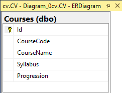

# DT207-moment1-backend

For this project, I wanted the backend to work completely on its own, without relying on any frontend, even though the assignment allowed using static files with a view engine: EJS or Pug. I saw it as a chance to push myself and try building something that felt closer to real-world, production-level software (not that I’m saying this is quite there yet, but I figured it was time to start shaping up). That’s why I went with an MVC-style backend using Node.js and Express.

I made a bunch of design choices that might seem a bit overkill for the size of the assignment, but I really wanted to experiment, learn new things, and bring in some of the stuff I’ve picked up over the years.

My solution, although very modular, is quite simple.

---

## 🧱 Project Structure

📦 project-root

├── server.ts         → Entry point: boots the server

├── app.ts            → App setup: middleware, routes, DB connection

├── config/           → env & cors & DB configuration

├── models/           → Shared interfaces and type aliases (e.g. ICourses)

├── middlewares/      → express-validator chains for input validation

├── routes/           → Route definitions + service injection

├── controllers/      → Request handlers that delegate to the service layer

├── service/          → Business logic layer (uses dependency injection)

├── dataAccess/       → Raw DB communication via stored procedures

---

## 📦 Deployment

Deployed on **Azure App Service**  
👉 [https://dt207g-moment1-backend.azurewebsites.net](https://dt207g-moment1-backend.azurewebsites.net)

---

## 🛠 Tech Stack

- **Node.js** / **Express**
- **TypeScript**
- **SQL Server**
- **express-validator**
- **Azure App Service** (deployment target)
- **GitHub Actions** (CI/CD pipeline)

---

## 📊 Entity Relationship Diagram

The database consists of a single `Courses` table, structured as follows:



| Column       | Type         | Description              |
|--------------|--------------|--------------------------|
| `Id`         | `INT`        | Primary key (auto-increment) |
| `CourseCode` | `NVARCHAR(6)`| Unique course identifier |
| `CourseName` | `NVARCHAR(50)`| Name of the course      |
| `Syllabus`   | `NVARCHAR(2083)`| URL to syllabus       |
| `Progression`| `CHAR(1)`    | Progression level (A/B/C) |

---

## 📡 API Endpoints

### `GET /courses`
Returns all courses from the database.

#### Response:
- Status code: `200 OK`
- Body:
```json
[
  {
    "id": 1,
    "courseCode": "DT162G",
    "courseName": "JavaScript Backend Development",
    "syllabus": "https://example.com/syllabus",
    "progression": "B"
  }
]
```
### `POST /courses/insert`

- Adds a new course.
- **Request Body** (must include a validated `courseCode`, `courseName`, `syllabus`, and `progression`)

Request body example:
```json
{
  "courseCode": "DT162G",
  "courseName": "JavaScript Backend Development",
  "syllabus": "https://example.com/syllabus",
  "progression": "B"
}
```
#### Response:
- Response: `201 Created`
- Body:
```json
{
  "message": "Course inserted successfully"
}
```
### `DELETE /courses/delete`

- Deletes a course by Id.
- **Request Body** (must include a validated numeric `id`)

Request body example:
```json
{
  "id": 1
}
```
#### Response:
- Response: `200 OK`
- Body:
```json
{
  "message": "Course deleted successfully"
}
```

---

## 🧪 Running Locally

### 🧰 Prerequisites

- [Node.js](https://nodejs.org/)
- [SQL Server](https://www.microsoft.com/en-us/sql-server/sql-server-downloads)
- [SQL Server Management Studio (SSMS)](https://learn.microsoft.com/en-us/sql/ssms/download-sql-server-management-studio-ssms) to run the setup script
- Git

---

### 🔧 Step 1: Clone the project
```bash
git clone https://github.com/RobinHawiz/DT207G-moment1-backend.git
```
```bash
cd DT207G-moment1-backend
```

---

### 📦 Step 2: Install dependencies
```bash
npm install
```

---

### 🧬 Step 3: Configure environment variables
```env
DB_USER=local
DB_PASSWORD=local
DB_NAME=cvdb
DB_HOST=YOUR_SERVER_NAME

APP_PORT=4000

CORS_ORIGIN=http://localhost:5173
```
⚠️ Make sure DB_USER and DB_PASSWORD match the credentials created in the SQL script.
This script creates a login/user local with password local and grants full access to the database.

💡 You can find your SQL Server name in SSMS under Server Name when connecting.

---

### 🏗️ Step 4: Set up the database via SSMS

- Open SQL Server Management Studio (SSMS)

- Connect to your local SQL Server instance

- Open the db/setup.sql file from this project

- Execute the script

---

### 🚀 Step 5: Run the backend server

```bash
npm run dev
```
Now your server will be live at http://localhost:4000

---

## 🚨 Having Trouble Connecting to the Database?

If your backend fails to connect to the SQL Server it’s likely due to SQL Server not being configured for SQL Server Authentication. SQL Server must be set to Mixed Mode Authentication (SQL + Windows) in order for user accounts like local to work.

✅ Watch this helpful tutorial to fix it:

📺 [How to Enable SQL Server Authentication (YouTube)](https://www.youtube.com/watch?v=uDS6c6DZyY4&t=397s&ab_channel=CodeandLogicMaker)

